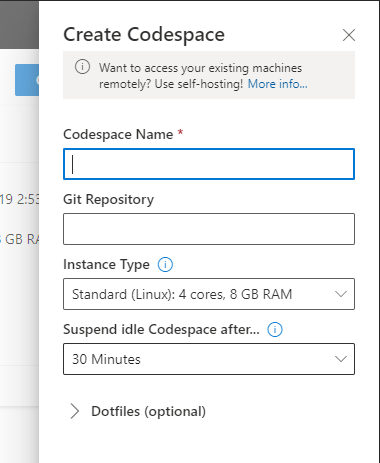
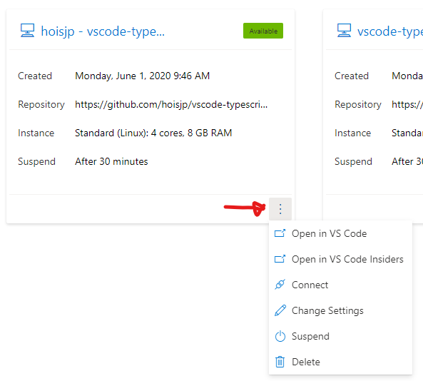

# Codespaces

## 本日のテーマ

Visual Studio Codespaces を使って TypeScript 開発環境を素早く構築しましょう。

## できること

VS Code がブラウザで開く、という点はひとつの大きな特徴ですが、本質的に以下のような点がより重要です。ワークショップを通じて、Codespacesの威力を理解していきましょう。

- コンテナを利用して、複数人へ同じ環境を提供する
- 拡張機能や設定などはローカルの VS Code 環境と隔離してインストール

### コンテナを利用して、複数人へ同じ環境を提供する

- .devcontainer/devcontainer.json
- .devcontainer/Dockerfile

### 拡張機能や設定などはローカルの VS Code 環境と隔離してインストール

- .devcontainer/devcontainer.json
  - extensions
  - settings
- .vscode
  - extensions.json
  - settings.json

## 手順

[https://online.visualstudio.com/environments] に Microsoft アカウントでログインして、右上 `Create Codespace` から新規 Codespace 環境を作成します。

- Codespace Name : 任意
- Git Repository : [https://github.com/asashiho/vscode-typescript-handson]
- Instance Type : 任意（デフォルト Standard）
- Suspend idle Codespace after... : 任意（デフォルト 30分）

メニューより、

- Connect : ブラウザで Visual Studio Codespaces を開く
- Open in VS Code (Insiders) : ローカル環境からリモート接続で Visual Studio Codespaces を開く

ブラウザで開いた場合、左下のリモート接続アイコンから Visual Studio Code を開くことができます。

### 課題 1 Codespaceの操作

- 上記、ブラウザ環境のCodespaceと、ローカル環境のCodespaceをそれぞれ開いてナビゲーションしてみましょう。
- Suspend することで、クラウド上のマシンリソースを停止できます。
- Suspend 時間はデフォルトで30分ですが、これを変更してみましょう。

### 課題 2 インストールされている拡張機能を確認する

左アクティビティバーのExtensionsアイコンより、以下2種類が区別されてインストールされていることを確認します。

- LOCAL - INSTALLED
- CODESPACES: ***

## トラブルシューティング

Codespaces を作成した直後に接続すると以下のようなエラーメッセージが出ることがあります。

この場合、ブラウザであればリロード、ローカル VS Code であれば再接続をします。
