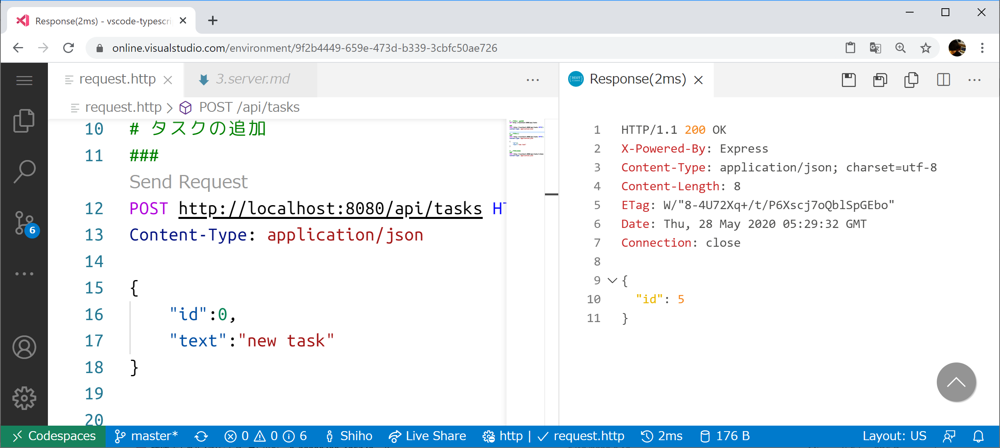

# 3. サーバ API の実装とデバッグ

このパートでは、Visual Studio Codespases を使ってサーバAPIの実装とデバッグを行います。
もし分からなくなったかたは、`../src-answer/`や`../src-answer/` にヒントがありますので、確認してみてください。 

> より詳細な解説については書籍「Visual Studio Code実践ガイド」を参照してください

## 3.1 サーバAPIの実装
参加者のみなさまに実装していただくのは、以下の2つです。

+ [src/server/main.ts](../src/server/main.ts) 実行の起点となるエントリーポイント

+ [src/server/api.ts](../src/server/api.ts)
API へのリクエストを Repository に流す API クラス

  - HTTP リクエストのメソッド（GET、POST）と、パスから、ロジックとの対応関係を示すルーティング [API.routing()](../src/server/api.ts#L45)
  - 実際にロジックを呼ぶ処理 [API.list()、API.create()、API.done()](../src/server/api.ts#L60)


|            課題4             |                                        |
| ---------------------------- | -------------------------------------- |
| タスクの完了を実装して下さい | [API.done()](../src/server/api.ts#L77) |

```typescript
/**
 * タスクの完了
 */
private done = (req: express.Request, res: express.Response) => {
    const id = parseInt(req.params.id, 10);

    // TODO: idのタスクを完了にする

    res.json({})
};
```


## 3.2 サーバの起動

サーバーの実装ができたら、いよいよ起動します。次のいずれかの方法でサーバーを起動してください。

### A. node コマンドの実行

Terminialから次のコマンドを実行してサーバを起動します。

```bash
node out/src/server/main.js
```
### A. ts-node コマンドの実行
ts-nodeを利用する場合は、次のコマンドを実行します。
「[ts-node](https://github.com/TypeStrong/ts-node)」は、TypeScriptのコードをJavaScriptにコンパイルしてから、nodeでJavaScriptを実行を行ってくれる便利なツールです。

```
./node_modules/.bin/ts-node src/server/main.js
```

## 3.3 デバック

コードをデバックしながら修正したいときは、[.vscode/launch.json](../.vscode/launch.json)を以下のように設定します。

デバッグにはスニペットを使えます。ここでも、ts-node が使えます。

```json
{
  "version": "0.2.0",
  "configurations": [
    {
      "type": "node",
      "request": "launch",
      "name": "Launch Server",
      "preLaunchTask": "tsc build",
      "program": "${workspaceFolder}/out/src/server/main.js",
      "outFiles": ["${workspaceFolder}/**/*.js"]
    },
    {
      "type": "node",
      "request": "launch",
      "name": "Launch Server(ts-node)",
      "runtimeArgs": ["-r", "ts-node/register"],
      "args": ["${workspaceFolder}/src/server/main.ts"]
    }
  ]
}
```

## 3.4 APIの動作確認
VS CodeでREST APIの動作確認をするのに便利な拡張機能が「[REST Client](https://marketplace.visualstudio.com/items?itemName=humao.rest-client)」です。
これを使うと、VS Code上でHTTPリクエストを送信し、VSCode上でレスポンスを確認できます。


> REST Clientは基本認証/ダイジェスト認証/SSLクライアント認証/Azure Active Directoryの認証にも対応しています。


リクエスト行には以下の書式で記述します。
```
メソッド パス名 HTTP/バージョン
```
メソッドを省略すると「GET」になります。クエリストリングを指定したいときは[?]で設定します。

リクエストヘッダーを指定するには、リクエスト行の次の行に値を指定します。上記の例では「content-type」に「application/json」を指定しています。


リクエストボディを指定するときは、リクエストヘッダーの後に1行分の空行を入れて値を指定します。次の例では、[id]に[0]、[text]に[new task]という値を設定しています。なお、複数のリクエストを送信したいときは、[###]で区切ります。

```
POST http://localhost:8080/api/tasks HTTP/1.1
Content-Type: application/json

{ 
    "id":0,
    "text":"new task"
}
```

リクエストを送信すると、レスポンスが返されるのを確認できます。
```
HTTP/1.1 200 OK
X-Powered-By: Express
Content-Type: application/json; charset=utf-8
Content-Length: 8
ETag: W/"8-4U72Xq+/t/P6Xscj7oQblSpGEbo"
Date: Thu, 28 May 2020 05:29:32 GMT
Connection: close

{
  "id": 5
}
```



今回実装したAPIの動作を確認するためのリクエストをrequest.httpというファイルに記述しています。

リクエストを送信するときは、`[Send Request]`をクリックするか`[Ctrl]` + `[Alt]` +`[R]` / `[⌘]` + `[Option]` + `[R]`をクリックします。

今回実装したAPIをコールするとどのような値が返るかをひととおり確認してみましょう！


### A. タスクの一覧取得

```md
GET http://localhost:8080/api/tasks
```
または
```
POST http://localhost:8080/api/tasks HTTP/1.1
content-type: application/json
```
### B. タスクの追加
```
POST http://localhost:8080/api/tasks HTTP/1.1
Content-Type: application/json

{ 
    "id":0,
    "text":"new task"
}
```
> 


###   C. タスクの終了
```
POST http://localhost:8080/api/tasks/1/done HTTP/1.1
Content-Type: application/json
```

---
|                          課題5                           |                                 |
| -------------------------------------------------------- | ------------------------------- |
| デバッグ実行で起動し、タスクの完了をデバッグして下さい。 | [request.http](../request.http) |


---

これで、STEP3:サーバAPIの実装とデバッグのハンズオンはおしまいです。

おつかれさまでした！

[STEP4: Frontend のデバッグ](./docs/4.frontend.md)
