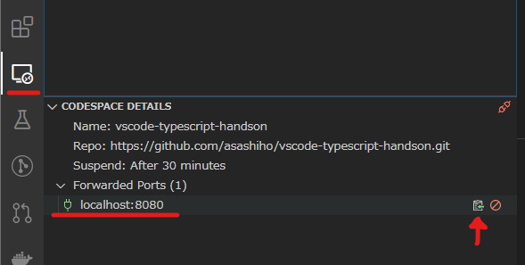
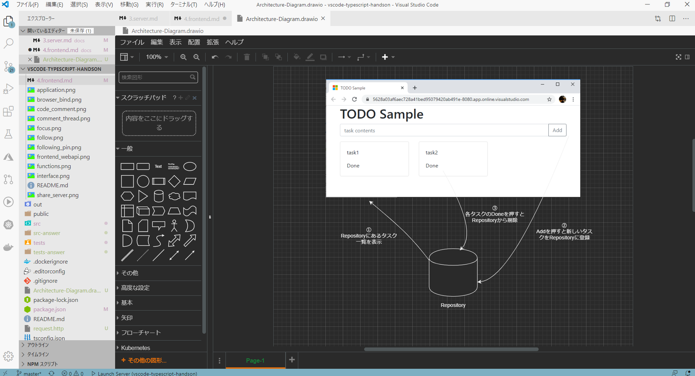

# 4. Frontend の開発

最後にVisual Studio Codespaces でFrontendの開発を行います。

## 4.1 コードの構成

```text
|- src
|  `- frontend
|    |- index.ts : エントリーポイント
|    |- api
|    |  `- task.ts : REST APIにアクセスする
|    `- views/ Vue.jsオブジェクト
|       |- newTask.ts : タスク作成UI
|       `- taskList.ts : タスク一覧と、タスクカード
`- public
   `- html
      |- js
      |  `- index.js : webpackで生成したJS
      `- index.html : HTML
```

## 4.2 webpackとは

webpack を使うと、commonjs 形式のモジュール（NodeJS で使われている）を、Web Browser でも実行できるように、依存関係を 1 つのソースコードにまとめてくれます。
設定ファイルは[webpack.config.js](../webpack.config.js)で、Type Script のコンパイルを行わせるようにしています。

```sh
./node_modules/.bin/webpack src/frontend/ ./src/frontend/index.ts --output ./public/html/js/index.js
```

Task 化すると、以下のようになります。

```json
{
  "version": "2.0.0",
  "tasks": [
    {
      "label": "morimoto webpack build",
      "command": ["${workspaceFolder}/node_modules/.bin/webpack"],
      "args": [
        "./src/frontend/index.ts",
        "--output",
        "./public/html/js/index.js"
      ],
      "type": "shell",
      "group": {
        "kind": "build",
        "isDefault": true
      },
      "problemMatcher": ["$tsc"]
    }
  ]
}
```

また、バックグラウンドプロセスでファイルの変更を検知し、自動でビルドする`webpack -w`というオプションがあります。
これを用いて Task 化する場合は次のようになります。

```json
{
  "version": "2.0.0",
  "tasks": [
    {
      "label": "webpack build (watch)",
      "command": ["${workspaceFolder}/node_modules/.bin/webpack"],
      "args": [
        "-w",
        "./src/frontend/index.ts",
        "--output",
        "./public/html/js/index.js"
      ],
      "type": "shell",
      "problemMatcher": ["$tsc"],
      "isBackground": true,
      "runOptions": {
        "runOn": "folderOpen"
      }
    }
  ]
}
```

なお、`"runOptions"."runOn": "folderOpen"`を設定すると、ワークスペースを開いた時に自動で実行させることができます。

## 4.3 動作確認

前のSTEP3で構成した server を起動し、`http://localhost:8080/index.html`にアクセスすると、フロントエンドを含んだページを表示できます。

Visual Studio Codespacesでは、`Forward a Port`コマンドでサーバで起動したポートをローカルにつなぐことができ、手元の Web ブラウザで起動して確認することができます。



注意：

* Webブラウザによる確認は、ローカルの Visual Studio Code で Codespaces へリモート接続することを推奨します。
* ブラウザ版 Codespaces では以下のようなURLが与えられ、最低限の確認を行うことができますが、Port Forwardingがアプリケーションの想定どおりに動作しないことがあります。  
`https://*****-8080.app.online.visualstudio.com/`

---
|課題6| |
|--|--|
|タスクの Done ボタンを押した時の、API へのアクセスの動作を実装して下さい。| [src/frontend/api/task.ts#L29](../src/frontend/api/task.ts#L29)|

```typescript
/**
 * タスクの完了をリクエストする
 */
export async function postTaskDone(task: ITask): Promise<void> {
    // TODO: urlを作成する /api/tasks/<id>/done

    const url = "/api/TODO:";
    await fetch(url, {
        method: "POST",
        headers: {
            "Content-Type": "application/json",
        },
    });
}
```

---

## おまけ

番外編として、開発に便利な拡張機能 [Draw.io Integration](https://marketplace.visualstudio.com/items?itemName=hediet.vscode-drawio) をご紹介します。

Draw.ioはフローチャートやネットワーク図、ER図といった豊富なテンプレートを使用して作図ができるサービスです。このDraw.ioをVS Codeで利用できる拡張機能が[Draw.io Integration](https://marketplace.visualstudio.com/items?itemName=hediet.vscode-drawio) です。

Draw.ioで作成した図はPNGやJPEGなどの画像形式だけでなく、 SVGやXMLといった豊富な拡張子でエクスポートできます。

試しに、今回作成したアプリの構成図を[Architecture-Diagram.drawio](./Architecture-Diagram.drawio)を開き、確認してください。また時間のある方は、STEP1の構成図を作成してみましょう！



その他、便利な拡張機能を[こちら](https://github.com/vscode-textbook/favorite-extensions)で紹介していますので、みなさんのおすすめがありましたら、ぜひPull Requestをお願いします。

---
これで、オンラインハンズオンはおしまいです。

Enjoy！

> 参考書籍:
>
> * [Visual Studio Code実践ガイド—最新コードエディタを使い倒すテクニック](https://gihyo.jp/book/2020/978-4-297-11201-1) [技術評論社]
> * [プログラマーのためのVisual Studio Codeの教科書](https://book.mynavi.jp/ec/products/detail/id=115232) [マイナビ出版]
